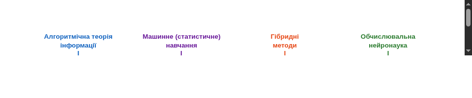
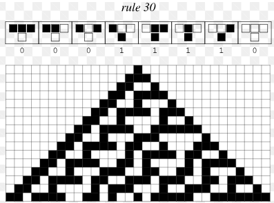
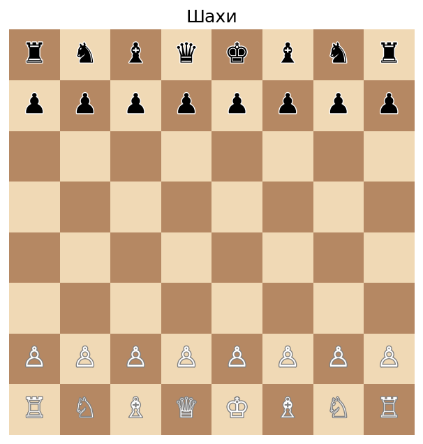
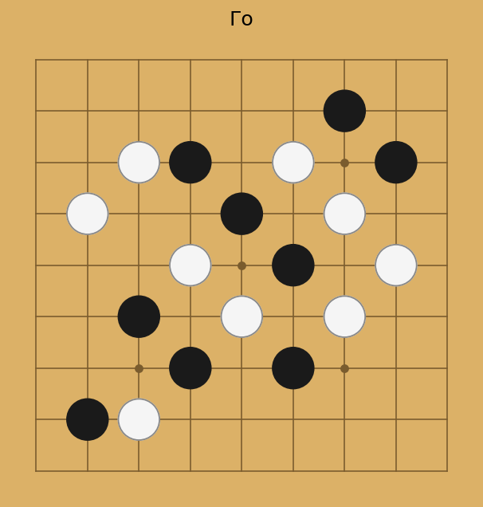
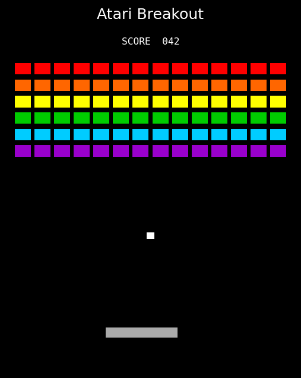

# Оновлення курсу

::: {.content-visible when-format="revealjs"}

:::

::: {.content-visible when-format="beamer"}
{width=100%}
:::

> Раніше: лекції по різних підходах до ЗШІ

> **Зараз:** лекції для практики 

Орієнтовний план: 

 1. 1d бінарне дискретне середовище 
 2. 2d бінарне дискретне середовище
 3. 2d бінарне неперервне середовище
 4. 2.5d бінарне неперервне середовище 
 5. 3d середовище (просте)
 6. 3d середовище (складне)

# Що таке загальний штучний інтелект (ЗШІ)?

**Технічне визначення (М. Гуттер)**

> ЗШІ - система, що досягає цілей в різних середовищах.

Ключовим є побудова ефективної моделі середовища.

Як оцінити складність середовища? 

Що таке ефективна модель?

::: {.content-visible when-format="revealjs"}
:::{.absolute top="150" right="50" width="350"}
{width=100%}

::: {style="text-align:center; font-size:0.7em;"}
cake analogy
:::
:::
:::

::: {.content-visible when-format="beamer"}
{width=30% fig-align="right"}
:::

# Чому досі немає ЗШІ?

**Гіпотеза Тюрінга (1950)**

> Якщо запрограмувати «дитячий розум» (tabula rasa) та надати йому можливість навчатися — можна отримати ЗШІ.

**Проблема:** вроджених структур значно більше, ніж вважав Тюрінг.
Мозок — не чистий аркуш, а складна архітектура з багатьма індуктивними упередженнями (inductive biases).
Приклади: (увага до обличчя з народження, страх висоти ...)

# Цикл агент–середовище

- **Середовище** $W$ — світ, в якому існує агент
- **Агент** — взаємодіє з $W$ через сприйняття <-> дії
- **Модель світу** — внутрішнє представлення $W$
- **Цілі** — бажані стани 

# 1D бінарне дискретне середовище

Бінарний вектор довжини $N$. **Кількість станів:** $2^N$. 

$$W_t = (w_0, w_1, \dots, w_{N-1}), \quad w_i \in \{0, 1\}$$

Час дискретний: $t = 0, 1, 2, \dots$. Середовище статичне: $W_{t+1} = W_t$ (пізніше ускладнимо).

Варіанти топології:

1. **Лінійне** — є два кінці; потрібно визначити граничні умови:
   - **Відбиваючі межі** — агент відбивається: $r_t=0, a_t=-1 \Rightarrow r_{t+1}=1$
   - **Поглинаючі межі** — агент зупиняється або "гине" на краю
   - **Нескінченне** — $r \in \mathbb{Z}$, меж немає взагалі

2. **Кільце (ring)** — $r_{t+1} = (r_t+a) \mod N$, немає меж, вже у слайді

3. **Стрічка Мьобіуса** — кінці з'єднані з перекрутом

::: {.content-visible when-format="revealjs"}
:::{.absolute top="650" right="50" width="350"}
{width=100%}

::: {style="text-align:center; font-size:0.7em;"}
стрічка Мьобіуса
:::
:::
:::

::: {.content-visible when-format="beamer"}
{width=25% fig-align="right"}
:::

# Агент

- **Позиція:** $r_t \in \{0, \dots, N-1\}$
- Час дискретний: $t = 0, 1, 2, \dots$
- **Дії:** $a_t \in \{-1, 0, +1\}$:
- Нова позиція:  $r_{t+1} = (r_t + a_t) \mod N$ (кільце) або $r_{t+1} = r_t + a_t$ (лінія)

# Сприйняття {.smaller}
В момент часу $t$ агент отримує сприйняття $o_t$, яке залежить від поточного стану середовища $W_t$ та позиції агента $r_t$. 
$$o_t \in \{0, 1\}^M$$

Агент зчитує $M$ сусідніх бітів навколо своєї позиції $r_t$.
Сприйняття зазвичай **обмежене** ($M \ll N$) і **зашумлене** $o'_t = o_t \oplus \varepsilon, \quad \varepsilon \sim \text{Bern}(q)$. 

$\oplus$ це **XOR (exclusive OR)** оператор — для бінарних значень:

| $o$ | $\varepsilon$ | $o \oplus \varepsilon$ |
|---|---|---|
| 0 | 0 | 0 |
| 0 | 1 | 1 |
| 1 | 0 | 1 |
| 1 | 1 | 0 |

У контексті шуму: $\varepsilon \sim \text{Bern}(q)$ генерує випадковий біт, який дорівнює 1 з ймовірністю $q$ (ймовірність інверсії). Коли $\varepsilon = 1$, спостережуваний біт **інвертується**; коли $\varepsilon = 0$, він залишається незмінним. Це стандартна модель для **бінарного симетричного каналу** шуму.

# Модель світу
$M_t \in \{0, 1\}^K$ — бінарний вектор, який оновлюється після кожного спостереження.

Характеристики:

- **Обмежений розмір:** $K \ll N$, не може зберігати повну інформацію про $W$.
- **Динамічний:** змінюється з часом, відображаючи нову інформацію.
- **Суб'єктивний:** може не відповідати реальному стану середовища, але корисний для прийняття рішень.
- Відображення середовища: $\hat{W}_{t} = f(M_t)$
- Система координат: відносно агента (егоцентрична), відносно об'єктів (аллоцентрична)

# Цілі агента ($R_t$ -> max) {.smaller}

**1. Реконструкція середовища** — точно запам'ятати $W$:
$$R_t = -\|\hat{W}_t - W_t\|_1 = -\sum_{i=0}^{N-1} |\hat{w}_i - w_i|$$

**2. Exploration (дослідження)** — відвідати невідомі позиції, зменшити невизначеність.

**3. Передбачення** — передбачити наступне сприйняття:
$$R_t = -\|o_{t+1} - \hat{o}_{t+1}\|, \quad \hat{o}_{t+1} = g(M_t, a_t)$$

**4. Пошук патерну** — знайти позицію, де $o_t = P$ для заданого патерну $P \in \{0,1\}^M$:
$$R_t = \mathbf{1}[o_t = P]$$
(stringology: KMP, Boyer-Moore — $O(N+M)$)

**5. Найближчий патерн** — знайти позицію з найменшою відстанню Гемінга до $P$:
$$R_t = -d_H(o_t, P) = -\sum_{j=0}^{M-1} o_t^j \oplus P^j$$

# Стратегія агента

**Реактивна** — дія залежить лише від поточного сприйняття:
$$\pi: o_t \mapsto a_t$$

**З моделлю світу** — дія залежить від внутрішнього стану моделі:
$$\pi: (o_t, M_t) \mapsto a_t$$

**З пам'яттю (історією)** — дія залежить від усієї попередньої історії:
$$\pi: (o_0, a_0, o_1, a_1, \dots, o_t) \mapsto a_t$$

> У загальному випадку модель $M_t$ є **стиснутим представленням** історії: $M_t = f(M_{t-1}, o_t, a_{t-1})$

# Демонстрація

::: {.content-visible when-format="revealjs"}

:::

::: {.content-visible when-format="beamer"}
*(інтерактивна демонстрація — доступна в HTML-версії)*
:::

#  1D клітинний автомат

**Правило оновлення:** стан кожної клітини $w_i^{t+1}$ визначається трьома сусідами:

$$w_i^{t+1} = f(w_{i-1}^t,\; w_i^t,\; w_{i+1}^t)$$

Три сусіди → $2^3 = 8$ можливих комбінацій → 

$2^8 = 256$ різних правил.

::: {.content-visible when-format="revealjs"}
:::{.absolute top="160" right="0" width="700"}
{width=100%}

::: {style="text-align:center; font-size:0.7em;"}
Правило 30
:::
:::
:::

::: {.content-visible when-format="beamer"}
{width=70% fig-align="center"}
:::

# Класи Вольфрама

Вольфрам класифікував 256 правил за поведінкою у 4 класи:

| Клас | Поведінка | Приклад правил |
|---|---|---|
| **I** | Всі клітини → однорідний стан | 0, 255 |
| **II** | Стабільні або циклічні структури | 4, 108 |
| **III** | Хаотична, псевдовипадкова | **30**, 45, 73 |
| **IV** | Складні локальні структури, на межі хаосу | **110**, 54 |

**Для агента:** середовища класу IV — найцікавіші: достатньо складні, щоб навчатися, але не повністю випадкові.

# Складність середовища (1)

**1. Ентропія Шеннона** (статистична складність):
$$H(W) = -\hat{p}\log_2\hat{p} - (1-\hat{p})\log_2(1-\hat{p}), \quad \hat{p} = \tfrac{1}{N}\sum_{i=0}^{N-1} w_i$$
Вимірює лише частку одиниць. **Недолік:** `01010101` і `00001111` мають однакову ентропію, хоча структурно різні.

**2. Складність Колмогорова** (алгоритмічна):
$$K(W) = \min_{p:\; U(p) = W} |p|$$
де $U$ — універсальна машина Тюрінга, $|p|$ — довжина програми в бітах.
- $K(0^N) = O(\log N)$ — "надрукуй $N$ нулів"
- $K(\text{випадковий}) \approx N$ — не можна стиснути
- **Недолік:** не обчислювана в загальному випадку

# Складність середовища (2)

**3. Стиснення (LZ-складність)** — обчислювана апроксимація $K(W)$:
$$C(W) = \frac{|\text{compress}(W)|}{N} \in [0, 1]$$
На практиці: gzip, zlib. $C \approx 0$ для структурованих, $C \approx 1$ для випадкових.

І ще інші міри ...

# Недетерміноване середовище {.smaller}

Нехай одна клітина $w_i$ змінюється з часом за **невідомим** розподілом:
$$p(w_i = 1) = \theta, \quad \theta \in [0, 1]$$

Агент спостерігає послідовність $w_i^0, w_i^1, w_i^2, \dots$ і будує модель $q(\theta)$.

**Ентропія клітини** — невизначеність її стану:
$$H(w_i) = -\theta\log_2\theta - (1-\theta)\log_2(1-\theta)$$

Максимальна при $\theta = 0.5$ (1 біт), мінімальна при $\theta \in \{0, 1\}$ (0 біт).

**Модель агента** — оцінка $\hat{\theta}$ з $T$ спостережень:
$$\hat{\theta} = \frac{1}{T}\sum_{t=0}^{T-1} w_i^t$$

**KL-дивергенція** — якість моделі $\hat{\theta}$ відносно реального $\theta$:
$$D_{\text{KL}}(p \| q) = \theta\log_2\frac{\theta}{\hat{\theta}} + (1-\theta)\log_2\frac{1-\theta}{1-\hat{\theta}} \geq 0$$

# Формальна модель агента {.smaller}

:::: {.columns}
::: {.column width="50%"}

Кортеж $\langle S, A, O, T, \Omega, R \rangle$:

| Символ | Загально | 1D бінарне |
|---|---|---|
| $S$ | стани середовища | $(W_t, r_t) \in \{0,1\}^N \times \{0,\dots,N-1\}$ |
| $A$ | дії агента | $a_t \in \{-1, 0, +1\}$ |
| $O$ | спостереження | $o_t \in \{0,1\}^M$ |
| $T$ | функція переходу | $W_{t+1}{=}W_t,\; r_{t+1}{=}(r_t{+}a_t)\bmod N$ |
| $\Omega$ | функція спостереження | $o_t = W_t[r_t{-}\lfloor M/2\rfloor : r_t{+}\lfloor M/2\rfloor]$ |
| $R$ | функція нагороди | $-D_{\text{KL}}(p \| q_t)$ або $-\|\hat{W}_t - W_t\|$ |

:::
::: {.column width="50%"}

**Стан агента** включає модель світу:
$$(o_t, M_t) \xrightarrow{\pi} a_t$$

**Оновлення моделі:**
$$M_{t+1} = f(M_t,\; o_t,\; a_t)$$

**Мета агента:**
$$\pi^* = \arg\max_\pi \mathbb{E}\left[\sum_{t=0}^{\infty} \gamma^t \cdot R(W_t, r_t, a_t)\right]$$

де $\gamma \in [0,1)$ — коефіцієнт дисконтування.

::: {.callout-note}
У нашому випадку: $|S| = 2^N \cdot N$, $|A| = 3$, $|O| = 2^M$, причому $M \ll N$ — часткова інформація.
:::

:::
::::

# Інші приклади середовищ

| Середовище | $S$ | $A$ | $O$ | $R$ |
|---|---|---|---|---|
| **Шахи** | $\sim 10^{47}$ позицій | $\sim 30$ ходів | $S$ (повна) | $+1 / -1$ за результат |
| **Го** | $\sim 10^{170}$ позицій | $\sim 250$ ходів | $S$ (повна) | $+1 / -1$ за результат |
| **Atari** | RAM $2^{1024}$ | 18 кнопок | Кадр $84{\times}84$ | Ігровий рахунок |
| **1D бінарне** | $\{0,1\}^N \times \{0,\dots,N{-}1\}$ | $\{-1,0,+1\}$ | $\{0,1\}^M$, $M{\ll}N$ | $-\|\hat{W}_t - W_t\|_1$ |

::: {style="display:flex; gap:1em; justify-content:center; margin-top:0.5em;"}
{width=20%}
{width=20%}
{width=20%}
:::

# Огляд лекції {.smaller}

1. **Середовище** — $W_t \in \{0,1\}^N$, топологія (лінія / кільце / Мьобіус)
2. **Агент** — позиція $r_t$, дії $a_t \in \{-1,0,+1\}$
3. **Сприйняття** — вікно $o_t \in \{0,1\}^M$, бінарний шум $\varepsilon \sim \text{Bern}(q)$
4. **Модель світу** — $M_t \in \{0,1\}^K$, $K \ll N$, суб'єктивна оцінка $\hat{W}_t$
5. **Цілі агента** — реконструкція, exploration, передбачення, пошук патерну
6. **Стратегія** — реактивна / з моделлю / з пам'яттю
7. **1D клітинний автомат** — 256 правил, 4 класи Вольфрама
8. **Складність** — ентропія Шеннона, складність Колмогорова, LZ-стиснення
9. **Недетермінованість** — $\theta$-модель, KL-дивергенція
10. **Формальна модель** — POMDP $\langle S, A, O, T, \Omega, R \rangle$

# Питання для самоперевірки {.smaller}

1. Скільки різних станів має середовище $W \in \{0,1\}^N$? Від чого залежить розмір простору станів?
2. Чим відрізняється **лінійна** топологія від **кільцевої**? Як задаються граничні умови?
3. Які цілі агента в 1d бінарному дискретному середовищі?
4. Чому модель світу $M_t$ є **суб'єктивною** — і коли вона може бути хибною?
5. В чому різниця між стратегією з **моделлю світу** і стратегією з **пам'яттю (історією)**?
6. Яке правило клітинного автомата дає **хаотичну** поведінку? Яке — **складні структури**?
7. Навіщо використовувати LZ-стиснення замість складності Колмогорова?
8. Параметр $\theta$ у недетермінованому середовищі невідомий. Як агент будує оцінку $\hat{\theta}$?
9. Запишіть формальну модель агента як POMDP для 1D бінарного середовища (назвіть усі 6 елементів).
10. Порівняйте Atari та 1D бінарне середовище за формалізмом: що є $S$, $A$, $O$, $R$ у кожному?

