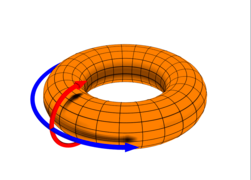
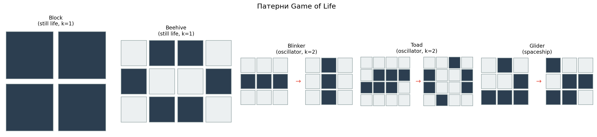
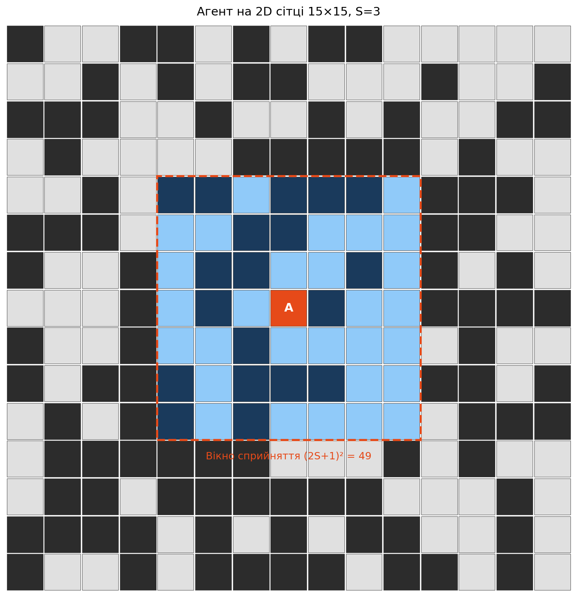
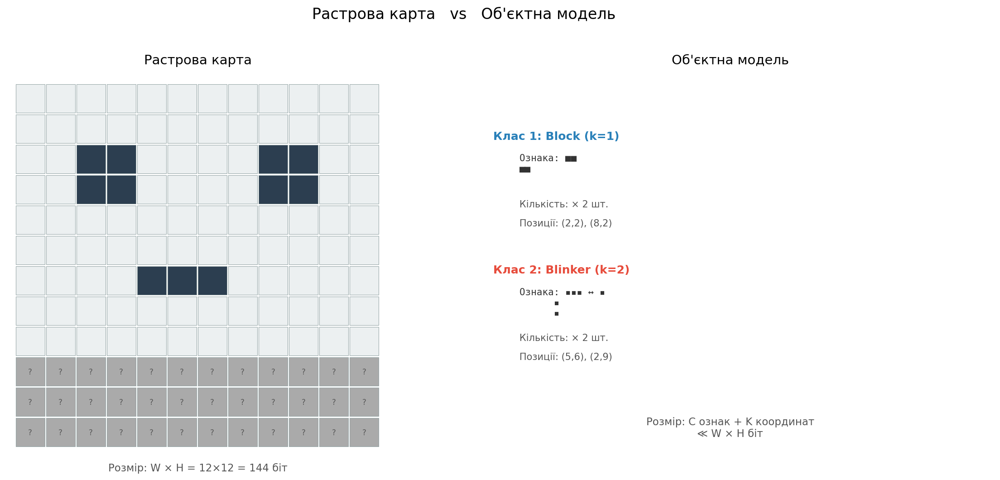
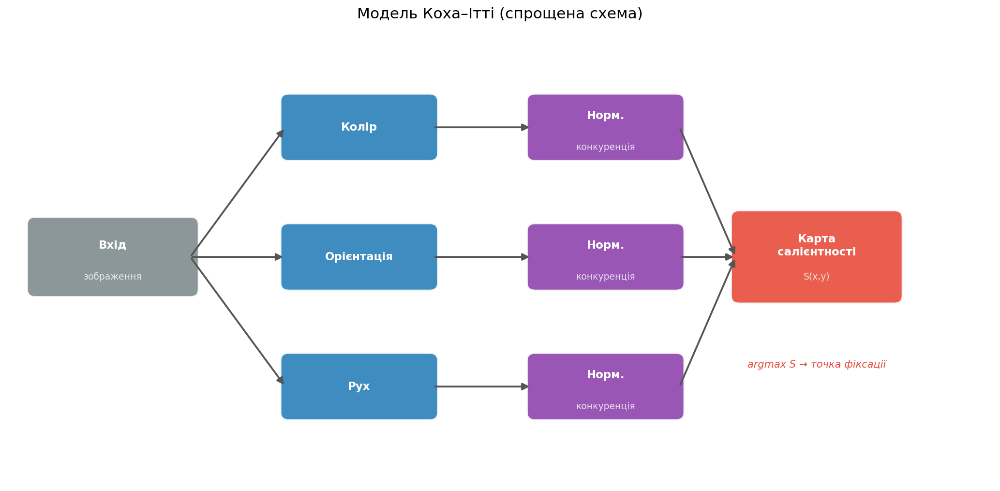
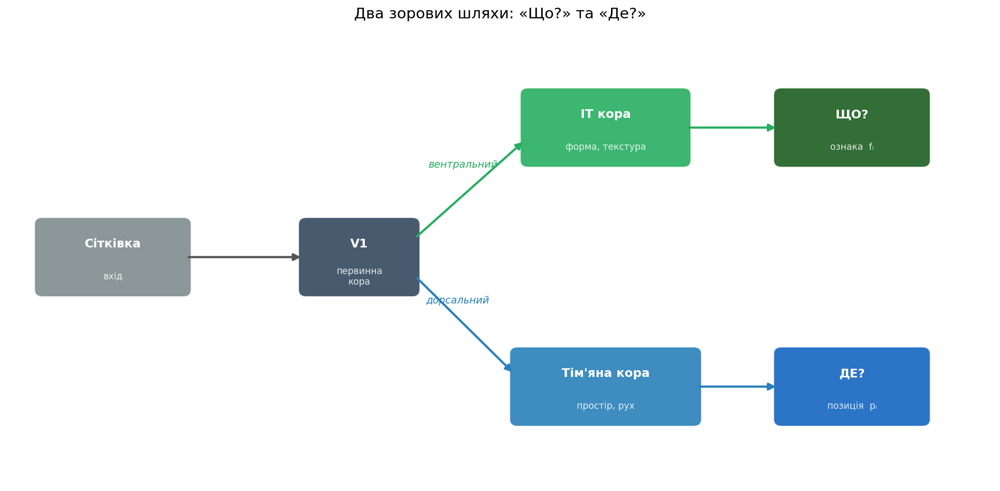

# Від 1D до 2D


> **Лекція 4:** 1D бінарне дискретне **статичне** середовище

> **Сьогодні:** 2D бінарне дискретне **динамічне** середовище

| | Лекція 4 (1D) | Лекція 5 (2D) |
|---|---|---|
| **Простір** | Вектор $\{0,1\}^N$ | Матриця $\{0,1\}^{W \times H}$ |
| **Динаміка** | Статичне або правило 30 | Game of Life |
| **Дії** | $\{-1, 0, +1\}$ | $\{\uparrow, \downarrow, \leftarrow, \rightarrow, 0\}$ |
| **Сприйняття** | Вікно $2S+1$ | Патч $(2S+1)^2$ |
| **Складність** | $2^N$ | $2^{W \times H}$ |


# 2D бінарне дискретне середовище

Бінарна матриця розміром $W \times H$ бітів:

$$\mathcal{W}_t = \{w_{x,y}^{(t)}\}_{x \in [0,W), \; y \in [0,H)}, \quad w_{x,y} \in \{0, 1\}$$

**Кількість станів:** $|S| = 2^{W \times H}$

Час дискретний: $t = 0, 1, 2, \dots$

Середовище **динамічне**: $\mathcal{W}_{t+1} \neq \mathcal{W}_t$ — стан змінюється за правилами клітинного автомата.

::: {.callout-note}
При $W = H = 50$: $|S| = 2^{2500} \approx 10^{752}$ — більше, ніж атомів у Всесвіті ($\approx 10^{80}$).

Порівняйте: 1D середовище $N=100$: $2^{100} \approx 10^{30}$ — «лише» квінтільйон квінтільйонів.
:::


# Топологія {.smaller}

:::: {.columns}
::: {.column width="50%"}

**1. Прямокутник з межами** — чотири краї:

- **Відбиваючі**: агент відбивається
- **Поглинаючі**: агент зупиняється
- **Нескінченне**: $\mathbb{Z}^2$

**2. Тор** *(основний у практиці)* — обидві осі замкнені:

$$w_{x,y} = w_{x \bmod W, \; y \bmod H}$$

Агент виходить за правий край → з'являється зліва; за нижній → зверху.

**3. Циліндр** — одна вісь замкнена, інша — з межами

**4. Пляшка Клейна** — одна вісь з перекрутом (2D аналог стрічки Мьобіуса)

:::
::: {.column width="50%"}
{width=85%}

:::
::::


# Складність простору станів

| Середовище | Кількість станів | Порядок |
|---|---|---|
| 1D, $N = 20$ | $2^{20}$ | $\approx 10^6$ |
| 1D, $N = 100$ | $2^{100}$ | $\approx 10^{30}$ |
| **2D, $10 \times 10$** | $2^{100}$ | $\approx 10^{30}$ |
| **2D, $50 \times 50$** | $2^{2500}$ | $\approx 10^{752}$ |
| Go ($19 \times 19$) | $\approx 3^{361}$ | $\approx 10^{170}$ |

Навіть **сприйняття** агента має величезний простір.

При радіусі $S = 9$ вікно $19 \times 19 = 361$ клітина:

$$|O| = 2^{(2S+1)^2} = 2^{361} \approx 10^{108}$$

Але це лише $\approx 14\%$ від світу $50 \times 50$. Решта — **невідома**.


# Гра життя — правила {.smaller}

**John Conway, 1970** — клітинний автомат на 2D сітці.

Стан клітини залежить від кількості **живих сусідів** $n_{x,y}^{(t)}$ у 8-зв'язковому оточенні (околиця Мура):

$$n_{x,y}^{(t)} = \sum_{(i,j) \in \mathcal{N}(x,y)} w_{i,j}^{(t)}$$

Правила оновлення:

$$w_{x,y}^{(t+1)} = \begin{cases} 1, & \text{якщо } n_{x,y}^{(t)} = 3 & \text{(народження)} \\ w_{x,y}^{(t)}, & \text{якщо } n_{x,y}^{(t)} = 2 & \text{(виживання)} \\ 0, & \text{інакше} & \text{(смерть)} \end{cases}$$

:::: {.columns}
::: {.column width="50%"}

**Інтуїція:**

- Порожньо → 3 сусіди → **народження** (ідеальні умови)
- Живий + 2–3 сусіди → **виживання** (стабільність)
- < 2 сусіди → **самотність** (смерть)
- \> 3 сусіди → **перенаселення** (смерть)

:::
::: {.column width="50%"}

**Реалізація** (NumPy, векторизовано):

```python
p = np.pad(state, 1, mode='wrap')  # тор!
n = (p[:-2,:-2] + p[:-2,1:-1] + p[:-2,2:]
   + p[1:-1,:-2]              + p[1:-1,2:]
   + p[2:, :-2] + p[2:, 1:-1] + p[2:, 2:])
survive = (state == 1) & ((n == 2) | (n == 3))
born    = (state == 0) & (n == 3)
state   = (survive | born).view(np.uint8)
```

:::
::::


# Гра життя — патерни {.smaller}

Game of Life породжує **складну динаміку** з простих правил:

:::: {.columns}
::: {.column width="60%"}

| Тип | Приклад | Період | Поведінка |
|---|---|---|---|
| **Still life** | Block (2×2), Beehive | $k = 1$ | $w^{(t+1)} = w^{(t)}$ — незмінний |
| **Oscillator** | Blinker, Toad | $k > 1$ | $w^{(t+k)} = w^{(t)}$ — циклічний |
| **Spaceship** | Glider, LWSS | $k > 1$ | Цикл + зсув $(\Delta x, \Delta y)$ |
| **Methuselah** | R-pentomino | — | Довга нестабільна фаза |
| **Chaos** | Випадковий «суп» | — | Непередбачувана еволюція |

:::
::: {.column width="40%"}

{width=100%}

:::
::::

::: {.callout-note}
**Для агента:** різні патерни → різні «об'єкти» у моделі світу. Це основа для об'єктно-центричного сприйняття.
:::


# Гра життя — складність та обчислюваність

Game of Life — **Тюрінг-повний** автомат: у ньому можна побудувати будь-який обчислювальний процес.

Це означає: **неможливо** в загальному випадку передбачити стан $w_{x,y}^{(t+\Delta)}$ без покрокової симуляції всіх $\Delta$ кроків.

**Паралель з 1D клітинними автоматами (Лекція 4):**

| Клас Вольфрама | Поведінка | 2D аналог (Game of Life) |
|---|---|---|
| **I** — однорідний | Всі клітини однакові | Порожній світ / повністю заповнений |
| **II** — стабільний | Циклічні / фіксовані | Still life, осцилятори |
| **III** — хаотичний | Псевдовипадковий | «Суп» на ранніх стадіях |
| **IV** — складний | Локальні структури, на межі хаосу | **Game of Life у цілому** |

> Game of Life — каноноічний приклад класу IV: складні локальні структури, що виникають з простих правил. Ідеальне тестове середовище для агента.


# Демонстрація — Game of Life

::: {.content-visible when-format="revealjs"}

:::

::: {.content-visible when-format="beamer"}
*(інтерактивна демонстрація — доступна в HTML-версії)*
:::


# Агент {.smaller}

:::: {.columns}
::: {.column width="55%"}

**Позиція:**

$$\mathbf{r}_t = (x_t, y_t) \in [0, W) \times [0, H)$$

**Дії** — 4 кардинальні напрямки + стояти на місці:

$$a_t \in \{\uparrow, \downarrow, \leftarrow, \rightarrow, 0\}$$

**Рух** (тороїдальний):

$$x_{t+1} = (x_t + \Delta x) \bmod W$$
$$y_{t+1} = (y_t + \Delta y) \bmod H$$

де $(\Delta x, \Delta y) \in \{(0,-1), (0,1), (-1,0), (1,0), (0,0)\}$.

:::
::: {.column width="45%"}

**Порівняння з 1D:**

| | 1D | 2D |
|---|---|---|
| Позиція | $r_t \in [0, N)$ | $(x_t, y_t) \in [0,W) \times [0,H)$ |
| Дії | $\{-1, 0, +1\}$ | $\{\uparrow, \downarrow, \leftarrow, \rightarrow, 0\}$ |
| $|A|$ | 3 | 5 |
| Рух | $r_{t+1} = (r_t + a_t) \bmod N$ | $\mathbf{r}_{t+1} = (\mathbf{r}_t + \mathbf{a}_t) \bmod (W, H)$ |

**Ключова відмінність:** у 2D агент має $4$ напрямки + стояти на місці, що дає більше свободи, але й складнішу навігацію.

:::
::::


# Сприйняття {.smaller}

Агент бачить квадратне вікно $(2S+1) \times (2S+1)$ навколо своєї позиції:

$$o_t = \{w_{(x_t + i) \bmod W, \; (y_t + j) \bmod H}^{(t)}\}_{i,j \in [-S, S]}$$

:::: {.columns}
::: {.column width="50%"}

**Характеристики:**

- **Розмір:** $(2S+1)^2$ бітів
- **Егоцентричне:** центроване на агенті
- **Часткове:** $o_t \subset \mathcal{W}_t$ — агент **не бачить** увесь світ
- **Тороїдальне загортання:** працює біля країв

**Приклад:** $S = 9$, світ $50 \times 50$:

$$\frac{(2 \cdot 9 + 1)^2}{50 \times 50} = \frac{361}{2500} \approx 14.4\%$$

Агент бачить лише $\approx 1/7$ світу.

:::
::: {.column width="50%"}

{width=90%}

:::
::::

::: {.callout-note}
Порівняно з 1D (вигляд $2R+1$ із $N$), у 2D частка спостережуваної зони зменшується **квадратично**: $\frac{(2S+1)^2}{W \cdot H}$.
:::

# Модель світу — растрова карта {.smaller}

**Підхід 1: повна внутрішня копія середовища**

$$\hat{W} \in \{0, 1, ?\}^{H \times W}$$

де $?$ — «ще не спостережено» (невідомо).

:::: {.columns}
::: {.column width="50%"}

**Оновлення** (кожен крок):

$$\hat{w}_{x,y}^{(t)} = \begin{cases} w_{x,y}^{(t)}, & (x,y) \in \text{вікно сприйняття} \\ \hat{w}_{x,y}^{(t-1)}, & \text{інакше (застаріле!)} \end{cases}$$

**Розмір пам'яті:**

$|\mathcal{M}_{\text{raster}}| = 2 \cdot W \cdot H$ бітів (значення + маска `_known`)

:::
::: {.column width="50%"}

**Проблема 1. застарівання:**

У **динамічному** середовищі карта точна лише в зоні поточного сприйняття. За межами вікна клітини продовжують еволюціонувати, але агент цього не знає.

З кожним кроком $E = |\hat{W}_t - W_t|$ зростає для клітин поза сприйняттям.
**Проблема 2. пам'ять обмежена:**
Якщо $W$ великий, і є обмеження на пам'ять, зберігати повну карту може бути неможливо.

:::
::::

:::{.callout-note}
**Аналогія:** растрова карта — це «фотографічна пам'ять». Точна в момент спостереження, але швидко застаріває.
:::


# Модель світу — об'єктна модель {.smaller}

**Підхід 2: описати світ як колекцію об'єктів**

$$\mathcal{M}_t = \{(f_i, p_i)\}_{i=1}^{K}$$

де $f_i$ — **ознака** (бінарний патерн або цикл), $p_i$ — **позиція** (координати центроїда).

:::: {.columns}
::: {.column width="50%"}

**Для статичних об'єктів** ($k = 1$):
$f_i$ — один бінарний кадр

**Для осциляторів** ($k > 1$):
$f_i = [f_i^{(0)}, f_i^{(1)}, \dots, f_i^{(k-1)}]$ — цикл із $k$ кадрів

**Перевага:** стисне представлення:

$$K \ll W \cdot H$$

Замість $2500$ бітів для $50 \times 50$ — лише $K$ описів об'єктів.

:::
::: {.column width="50%"}

{width=100%}

:::
::::

::: {.callout-note}
## Аналогія з когнітивною наукою

Людина не запам'ятовує кожен піксель сцени — вона запам'ятовує **об'єкти та їх розташування**: «тут стіл, там книжка, там кухоль». Це **семантична пам'ять**.
:::


# Групування об'єктів за ознаками {.smaller}

Об'єкти з однаковими ознаками утворюють **клас**:

$$\mathcal{M}_t = \{(F_c, \{p_{c,1}, p_{c,2}, \dots, p_{c,n_c}\})\}_{c=1}^{C}$$

де $F_c$ — ознака класу (зберігається **один раз**), а $\{p_{c,j}\}$ — позиції всіх екземплярів.

**Приклад:** якщо у світі 15 блоків (2×2) — замість 15 патернів зберігаємо 1 патерн + 15 координат.

:::: {.columns}
::: {.column width="50%"}

**Алгоритм групування:**

1. Відфільтрувати об'єкти з відомим періодом
2. Розбити за періодом ($k = 1, 2, 3, \dots$)
3. Усередині кожної групи: порівняти ознаки через $d(A, B)$
4. $d \leq \theta$ → один клас; $d > \theta$ → різні класи

:::
::: {.column width="50%"}

**Виграш:** при $C \ll K$ — значне додаткове стиснення.

**Типовий сценарій:** у зрілому GoL-середовищі ($\sim 1000$ кроків) переважають кілька типів small still life та blinker-подібні осцилятори → $C$ невелике.

:::
::::


# Реконструкція з об'єктної моделі {.smaller}

Відновити повну растрову карту з об'єктної моделі:

:::: {.columns}
::: {.column width="50%"}

**Алгоритм:**

```python
grid = np.zeros((H, W), dtype=np.uint8)
for cls in object_model:
    feature = cls['feature']
    for (cx, cy) in cls['positions']:
        # наштампувати feature
        # з центром у (cx, cy)
        stamp(grid, feature, cx, cy)
return grid
```

Мертві клітини (фон) — нулі за замовчуванням.

:::
::: {.column width="50%"}

**Похибка** — нормалізована відстань Геммінга:

$$E_t = \frac{1}{W \cdot H} \sum_{x,y} |w_{x,y}^{(t)} - \hat{w}_{x,y}^{(t)}|$$

**Джерела помилки:**

- Фон між об'єктами (живі клітини поза об'єктами)
- Помилки сегментації (злиття / розпад об'єктів)
- Хаотичні зони без стійких патернів
- Неспостережені ділянки світу

:::
::::


# Стиснення vs точність {.smaller}

**Розмір пам'яті** для трьох представлень:

| Модель | Формула розміру (біт) |
|---|---|
| **Растрова карта** | $W \times H$ |
| **Об'єктна (без групування)** | $\sum_{i=1}^{K} (s_i^2 \cdot k_i + 2\lceil\log_2 W\rceil)$ |
| **Об'єктна (з групуванням)** | $\sum_{c=1}^{C} (s_c^2 \cdot k_c + n_c \cdot 2\lceil\log_2 W\rceil)$ |

де $s_i$ — розмір кропу, $k_i$ — період, $n_c$ — кількість екземплярів класу $c$.

**Компроміс — поріг $\theta$:**

| $\theta$ малий | $\theta$ великий |
|---|---|
| Більше класів $C$ | Менше класів $C$ |
| Точніша реконструкція | Менший розмір моделі |
| Менше стиснення | Більша похибка $E_t$ |

::: {.callout-note}
**Фундаментальний trade-off:** ефективна модель світу — це модель, що **стискає** реальність до компактного опису, зберігаючи **лише суттєве**. Що вважати «суттєвим» — визначає поріг $\theta$.
:::


# Передбачення для динамічних об'єктів {.smaller}

Об'єктна модель має унікальну перевагу: вона може **передбачувати** стан об'єктів поза зоною сприйняття.

:::: {.columns}
::: {.column width="50%"}

**Осцилятори** (відомий період $k$ та цикл):

$$\hat{f}_i^{(t)} = f_{i, \; t \bmod k}$$

При $\Delta t = t - t_{\text{last\_seen}}$ кроків після спостереження:

- $k = 1$ (still life): стан **завжди** точний
- $k = 2$ (blinker): потрібно лише знати фазу $\Delta t \bmod 2$
- Загальний осцилятор: $\Delta t \bmod k$

:::
::: {.column width="50%"}

**Рухомі об'єкти** (швидкість $v_i = (\Delta x / k, \Delta y / k)$):

$$\hat{p}_i^{(t)} = p_i^{(t_0)} + v_i \cdot (t - t_0)$$

**Порівняння з растровою картою:**

| Модель | $E$ при $\Delta t \to \infty$ |
|---|---|
| Растрова карта | $E \to ?$ (невизначено) |
| Об'єктна без передбачення | $E$ стабільна для still life |
| Об'єктна з передбаченням | $E$ стабільна для **всіх** об'єктів з відомим циклом |

:::
::::


# Saliency maps — мотивація з нейронауки {.smaller}

Людина не обробляє всю візуальну сцену одночасно — **увага** вибірково фокусується на найважливіших ділянках.

:::: {.columns}
::: {.column width="55%"}

**Модель Коха–Ітті (1998):**

1. Вхідне зображення → паралельні **карти ознак** (колір, орієнтація, рух)
2. Кожна карта → **нормалізація** (конкуренція за увагу)
3. Зведення → **єдина карта салієнтності** $S(x, y)$
4. $\arg\max S(x, y)$ → точка фіксації ока

**Ключова ідея:** не потрібно розпізнавати об'єкти, щоб привернути увагу — достатньо **контрасту** відносно оточення.

Це **bottom-up** (висхідний) процес: від сигналу до уваги, без знань про зміст.

:::
::: {.column width="45%"}

{width=100%}

:::
::::


# Saliency maps — реалізація в практиці {.smaller}

У нашому 2D бінарному середовищі реалізовано два типи салієнтності:

:::: {.columns}
::: {.column width="50%"}

**Motion saliency** — що змінюється?

Експоненційне ковзне середнє (EMA) різниці між кадрами:

$$\text{EMA}_t = \alpha \cdot \text{EMA}_{t-1} + (1 - \alpha) \cdot |o_t - o_{t-1}|$$

де $\alpha = 0.6$ — коефіцієнт згасання.

Висока для: **осциляторів**, рухомих об'єктів.
Низька для: статичних об'єктів (still life), пустих зон.

:::
::: {.column width="50%"}

**Static saliency** — де скупчення?

Гаусівський розмив живих клітин:

$$\text{Static}(x,y) = (o_t * G_\sigma)(x, y)$$

де $G_\sigma$ — Гаусівське ядро з параметром $\sigma$.

Висока для: **скупчень** живих клітин.
Використовується для **сегментації** → блоби (об'єкти-кандидати).

:::
::::

**Сегментація**: бінаризація → зв'язні компоненти → **блоби** з атрибутами: `centroid`, `area`, `bbox`, `motion_score`.


# Object-centric view — нейронаука {.smaller}

:::: {.columns}
::: {.column width="50%"}

**Два шляхи зорової обробки** (Ungerleider & Mishkin, 1982):

**Вентральний шлях ("Що?")** — від V1 до IT-кори:

- Розпізнавання **форми**, текстури, кольору
- Інваріантність до позиції, розміру, повороту
- **Ознака** об'єкта $f_i$

**Дорсальний шлях ("Де?")** — від V1 до тім'яної кори:

- Просторове **розташування** об'єктів
- Відстань, рух, координати
- **Позиція** об'єкта $p_i$

:::
::: {.column width="50%"}

{width=100%}

:::
::::

> Мозок будує **об'єктну модель**: кожен об'єкт = **(ознака, позиція)**. Це і є основна ідея для нашого агента.

**Завдання:**  розпізнавання патернів, оцінка схожості, кластеризація, сегментація, відстежування.


# Об'єкти в Game of Life {.smaller}

У Game of Life об'єкти мають природну класифікацію за динамікою:

:::: {.columns}
::: {.column width="55%"}

**Статичні** (still life), період $k = 1$:

$$f_i^{(t+1)} = f_i^{(t)}$$

Ознака — фіксований бінарний патерн.

**Осцилятори**, період $k > 1$:

$$f_i^{(t)} = f_i^{(t+k)}$$

Ознака — **цикл**: впорядкована послідовність із $k$ кадрів: $[f_i^{(0)}, f_i^{(1)}, \dots, f_i^{(k-1)}]$

**Рухомі об'єкти** (spaceships): осцилятор + зсув за період:

$$p_i^{(t+k)} = p_i^{(t)} + (\Delta x_i, \Delta y_i)$$

:::
::: {.column width="45%"}

**Опис об'єкта** (`WorldObject`):

| Поле | Зміст |
|---|---|
| `id` | Унікальний ідентифікатор |
| `centroid` | $(x, y)$ — позиція |
| `area` | Площа (кількість живих клітин) |
| `bbox` | Обмежувальна рамка |
| `motion_score` | Рухова салієнтність |
| `first_seen` | Крок першого спостереження |
| `last_seen` | Крок останнього спостереження |
| `history` | Темпоральна історія кадрів |

:::
::::


# Трекінг об'єктів {.smaller}

Підтримання ідентичності об'єктів між кадрами:

:::: {.columns}
::: {.column width="55%"}

**Алгоритм** (кожен крок):

1. **Конвертація координат**: блоби з локальних координат сприйняття → світові координати
2. **Жадібне зіставлення**: кожен існуючий об'єкт шукає найближчий блоб:
   $$d_{\text{tor}}(a, b) = \sqrt{(\min(\Delta x, W - \Delta x))^2 + (\min(\Delta y, H - \Delta y))^2}$$
   Зіставлення, якщо $d < r_{\text{match}}$
3. **Оновлення**: зіставлений об'єкт — оновити центроїд, площу, записати кадр в історію
4. **Створення нових**: незіставлені блоби → нові об'єкти (з перевіркою дублікатів)

:::
::: {.column width="45%"}

**Дедублікація**: перед створенням нового об'єкта — перевірка чи немає поблизу існуючого:

$$d_{\text{tor}}(p_{\text{new}}, p_{\text{old}}) < r_{\text{dedup}} \;\text{та}\; |S_{\text{new}} - S_{\text{old}}| \text{ мала}$$

**Важливо:** об'єкти **ніколи не видаляються** — навіть покинувши зону сприйняття, вони залишаються в пам'яті.

:::
::::


# Детекція періоду {.smaller}

`ObjectHistory` зберігає буфер останніх бінарних кадрів об'єкта (центрований кроп):

**Алгоритм** `_try_detect_period()`:

Для кожного кандидата-періоду $k = 1, 2, 3, \dots$ :

1. Порівняти кадри з відстанню $k$: $\text{diff} = \overline{|f_t - f_{t-k}|}$
2. Якщо $\text{diff} \leq \varepsilon$ (поріг $\varepsilon = 0.05$) — кандидат підтверджений
3. Потрібно $\geq 3$ підтвердження підряд (`MIN_CONFIRM = 3`)
4. При успіху: зберегти `period = k` та `cycle = [f_0, \dots, f_{k-1}]`

:::: {.columns}
::: {.column width="50%"}

**Приклад — blinker** (період 2):

| Крок | Кадр | diff з кроком $-2$ |
|---|---|---|
| $t$ | ▯▮▯ | — |
| $t+1$ | ▮▯▮ (повернутий) | — |
| $t+2$ | ▯▮▯ | $\leq \varepsilon$ ✓ |
| $t+3$ | ▮▯▮ | $\leq \varepsilon$ ✓ |
| $t+4$ | ▯▮▯ | $\leq \varepsilon$ ✓ → **k=2 підтверджено** |

:::
::: {.column width="50%"}

**Приклад — block** (період 1):

| Крок | Кадр | diff з кроком $-1$ |
|---|---|---|
| $t$ | ▮▮ / ▮▮ | — |
| $t+1$ | ▮▮ / ▮▮ | $0 \leq \varepsilon$ ✓ |
| $t+2$ | ▮▮ / ▮▮ | $0 \leq \varepsilon$ ✓ |
| $t+3$ | ▮▮ / ▮▮ | $0 \leq \varepsilon$ ✓ → **k=1** |

:::
::::


# Порівняння ознак — фазово-інваріантна відстань {.smaller}

Для порівняння двох об'єктів з однаковим періодом $k$:

Цикл A: $[a_0, a_1, \dots, a_{k-1}]$, &nbsp; Цикл B: $[b_0, b_1, \dots, b_{k-1}]$

$$d(A, B) = \min_{\phi \in [0, k)} \sum_{j=0}^{k-1} \|a_j - b_{(j + \phi) \bmod k}\|_1$$

Зсуваємо одну послідовність відносно іншої і беремо **мінімальну відстань Геммінга**.

:::: {.columns}
::: {.column width="50%"}

**Чому інваріантність до фази?**

Два блінкери, що почали осцилювати в різний момент, мають **однакову** ознаку — але їхні цикли зсунуті:

- Blinker 1: $[\texttt{---}, \texttt{||}]$ (фаза 0)
- Blinker 2: $[\texttt{||}, \texttt{---}]$ (фаза 1)

Мінімізація по $\phi$ це усуває.

:::
::: {.column width="50%"}

**Правила порівняння:**

- Різний період $k_A \neq k_B$: автоматично **різні** класи
- Однаковий $k$, $d \leq \theta$: **один** клас
- Однаковий $k$, $d > \theta$: **різні** класи
- Поріг $\theta$ — гіперпараметр (компроміс точність / стиснення)

:::
::::


# Модель світу — інші підходи {.smaller}

Окрім растрової та об'єктної моделі, існують інші підходи:

:::: {.columns}
::: {.column width="50%"}

**Нейромережеві моделі:**

- **Автоенкодер**: стискає спостереження до латентного вектора $z_t \in \mathbb{R}^d$
- **World model** (Ha & Schmidhuber, 2018): VAE + RNN для передбачення наступного стану
- **Transformer-based**: токенізація сітки, attention для просторових залежностей

**Переваги:** можуть вчитись з даних, узагальнювати

**Недоліки:** потрібно багато даних, непрозорі, обчислювально дорогі

:::
::: {.column width="50%"}

**Символьні / гібридні моделі:**

- **Правило-базовані**: зберігати правила GoL + симулювати
- **Граф сцени**: об'єкти + зв'язки між ними
- **Ієрархічні**: об'єкти → групи → регіони

**У нашій практиці:**

Растрова карта (базова) + об'єктна модель (це працює!) — жоден з цих підходів не вимагає навчання, що важливо для **розуміння** принципів.

:::
::::


# Цілі агента {.smaller}

**1. Побудова карти** — відвідати весь світ, заповнити маску `_known`:

$$R_t = \text{coverage}_t = \frac{|\{(x,y) : \hat{w}_{x,y} \neq ?\}|}{W \times H}$$

**2. Реконструкція** — точно відтворити поточний стан:

$$R_t = -E_t = -\frac{1}{WH}\sum_{x,y} |w_{x,y}^{(t)} - \hat{w}_{x,y}^{(t)}|$$

**3. Пошук патерну** — знайти об'єкт, найбільш подібний до зразка $P$:

$$R_t = -\min_{i} d(P, f_i)$$

де $d$ — відстань Геммінга (або косинусна) з ковзним вікном.

**4. Дослідження (exploration)** — зменшення невизначеності:

$$R_t = -H(\mathcal{W}_t | o_0, o_1, \dots, o_t)$$

> У загальному випадку: $\pi^* = \arg\max_\pi \mathbb{E}\left[\sum_{t=0}^{\infty} \gamma^t \cdot R_t\right]$


# Стратегія агента — політики {.smaller}

Паттерн **Стратегія**: `Policy → __call__(agent, model) → direction`

:::: {.columns}
::: {.column width="33%"}

**GreedyExplorer**

Один крок: рухатись туди, де найбільше невідомих клітин

```
for d in {↑,↓,←,→}:
  score[d] = count_unknown(
    perceive_at(pos + d))
return argmax(score)
```

✅ Швидкий старт
❌ Може застрягти

:::
::: {.column width="33%"}

**NearestUnknown**

Глобально: найкоротший шлях до найближчої невідомої клітини


Тороїдальна Манхеттенська відстань:

$$d_M = \min(\Delta x, W - \Delta x) + \min(\Delta y, H - \Delta y)$$

✅ Гарантовано покриває все
❌ Не «бачить» структуру

:::
::: {.column width="33%"}

**PatternSeek** (двофазна)

Фаза A: дослідити → NearestUnknown

Фаза B: знайти → навігація до найкращого об'єкта за `PatternMatcher`

$$\text{target} = \arg\min_{i} d(P, f_i)$$

✅ Пошук конкретного патерну
❌ Потрібна повна карта для фази B

:::
::::


# Формальна модель — POMDP {.smaller}

:::: {.columns}
::: {.column width="50%"}

Кортеж $\langle S, A, O, T, \Omega, R \rangle$:

| Символ | 2D бінарне дискретне |
|---|---|
| $S$ | $\{0,1\}^{W \times H} \times [0,W) \times [0,H)$ |
| $A$ | $\{\uparrow, \downarrow, \leftarrow, \rightarrow\}$ |
| $O$ | $\{0,1\}^{(2S+1)^2}$ |
| $T$ | GoL + $(x,y) \to (x+\Delta x, y+\Delta y) \bmod (W,H)$ |
| $\Omega$ | Тороїдальне вікно $(2S+1)^2$ |
| $R$ | Залежить від цілі (coverage / reconstruction / pattern) |

:::
::: {.column width="50%"}

**Порівняння з 1D (Лекція 4):**

| | 1D | 2D |
|---|---|---|
| $|S|$ | $2^N \cdot N$ | $2^{WH} \cdot WH$ |
| $|A|$ | $3$ | $4$ |
| $|O|$ | $2^{2R+1}$ | $2^{(2S+1)^2}$ |
| $T$ | Правило X або статичне | Game of Life |
| Часткова спостережуваність | Вікно $2R+1$ | Патч $(2S+1)^2$ |

**Мета агента:**

$$\pi^* = \arg\max_\pi \mathbb{E}\left[\sum_{t=0}^{\infty} \gamma^t \cdot R(s_t, a_t)\right]$$

:::
::::


# Огляд лекції {.smaller}

1. **Середовище** — $\mathcal{W}_t \in \{0,1\}^{W \times H}$, тороїдальна топологія
2. **Динаміка** — Game of Life: народження / виживання / смерть, Тюрінг-повний
3. **Складність** — $2^{W \times H}$ станів, навіть сприйняття $2^{(2S+1)^2}$
4. **Агент** — позиція $(x_t, y_t)$, 4 кардинальні дії
5. **Сприйняття** — патч $(2S+1)^2$, часткове ($\approx 14\%$ світу при $S=9$)
6. **Saliency maps** — motion (EMA) + static (Gaussian), сегментація → блоби
7. **Object-centric view** — об'єкт = (ознака, позиція), «що» + «де»
8. **Трекінг** — жадібне зіставлення, дедублікація, детекція періоду
9. **Порівняння ознак** — фазово-інваріантна відстань Геммінга
10. **Растрова vs об'єктна модель** — фотографічна vs семантична пам'ять
11. **Групування** — класи об'єктів, додаткове стиснення
12. **Реконструкція** — штамп ознак → карта, похибка $E_t$
13. **Стиснення vs точність** — поріг $\theta$, фундаментальний trade-off
14. **Передбачення** — осцилятори: $\hat{f} = f_{t \bmod k}$; spaceships: $+v \cdot \Delta t$
15. **Політики** — GreedyExplorer, NearestUnknown, PatternSeek
16. **POMDP** — формальна модель $\langle S, A, O, T, \Omega, R \rangle$


# Питання до самоперевірки {.smaller}

1. Чим відрізняється 2D бінарне дискретне середовище від 1D? Як змінюється простір станів?
2. Що таке тороїдальна топологія і як вона впливає на рух агента та сприйняття?
3. Запишіть правила Game of Life. Які типи патернів існують (still life, oscillator, spaceship)?
4. Чому Game of Life є Тюрінг-повним і що це означає для передбачення стану?
5. Що таке карта салієнтності? Чим відрізняються motion- та static-салієнтність?
6. Поясніть аналогію між зоровими шляхами «що» і «де» та об'єктною моделлю (ознака, позиція).
7. Як працює алгоритм трекінгу об'єктів? Навіщо потрібна дедублікація?
8. Як виявити період осцилятора? Що таке «фазово-інваріантне порівняння» і навіщо воно потрібне?
9. Порівняйте растрову та об'єктну модель світу: розмір пам'яті, точність, поведінка в динамічному середовищі.
10. Запишіть POMDP-кортеж для агента в 2D бінарному дискретному середовищі — усі 6 елементів.


