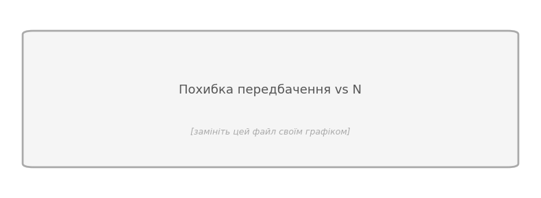
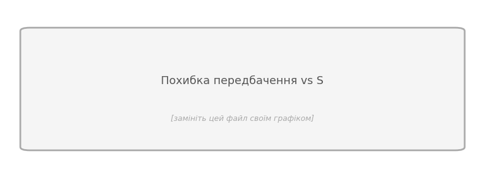

::: {.callout-note}
**Інструкція з вставки графіків.** Збережіть графік у `.py` файлі:
`plt.savefig('plot_error_vs_N.png', dpi=150, bbox_inches='tight')`  
Покладіть PNG поруч із цим файлом і вставте: `{width=90%}`
:::

---

# Завдання 2 — Реалізація симуляційного підходу

**Опис підходу.** Коротко поясніть ідею: що зберігає модель, як обчислюється прогноз, як оновлюється після спостереження.

> **[Відповідь студента]**

**Нові атрибути класу `Agent`:**

> **[Відповідь студента]** Перелічіть атрибути та їх призначення. Наприклад: `world_model` — копія середовища розміром $N$; `model_position` — оцінка поточної позиції.

**Логіка `predict_sim(action)`:**

> **[Відповідь студента]** Опишіть кроки словами.

**Логіка `update_model_sim()`:**

> **[Відповідь студента]** Опишіть кроки словами.

---

# Завдання 3 — Порівняльний аналіз

**Параметри експериментів:** $N \in$ [вказати], $S \in$ [вказати], кроків на запуск: [вказати].

## Похибка передбачення vs. $N$

*Фіксований $S =$ [вказати]*

{width=90%}

> **[Висновок студента]** Як поводяться два методи зі збільшенням $N$?

## Похибка передбачення vs. $S$

*Фіксований $N =$ [вказати]*

{width=90%}

> **[Висновок студента]** Як змінюється точність зі збільшенням $S$? Чи є точка перетину?

## Розмір моделі vs. $N$ та $S$

{width=90%}

> **[Висновок студента]** При яких умовах кожен підхід компактніший?

---

# Завдання 4 — Швидкість

**Параметри тесту:** $N =$ [?], $S =$ [?], повторень: 10 000.

| Метод | Передбачення (мкс) | Оновлення (мкс) |
|---|---|---|
| Словниковий | | |
| Симуляційний | | |

> **[Висновок студента]** Який метод швидший і чому? Чи залежить час від $N$ та $S$?

---

# Завдання 5 — Визначення кільцевої топології

> **[Відповідь студента]** Як агент може виявити кільцеву топологію, якщо бачить лише $M \ll N$ бітів? Опишіть ідею алгоритму та його обмеження (коли може помилятися?).

---

# Завдання 6 — Стискання моделі

*Оберіть будь-які два пункти з чотирьох.*

**6.[ ] [назва пункту]**

> **[Відповідь студента]**

**6.[ ] [назва пункту]**

> **[Відповідь студента]**

---

# Висновки

> **[Відповідь студента]** Який підхід краще для яких умов ($N$, $S$, пам'ять, швидкість)? Що виявилось несподіваним?

---

# Самооцінка

| Завдання | ✓ | Коментар |
|---|:---:|---|
| 2 — Опис реалізації | ☐ | |
| 3 — Графіки та висновки | ☐ | |
| 4 — Таблиця швидкості | ☐ | |
| 5 — Виявлення кільця | ☐ | |
| 6 — Стискання (≥ 2 з 4) | ☐ | |
